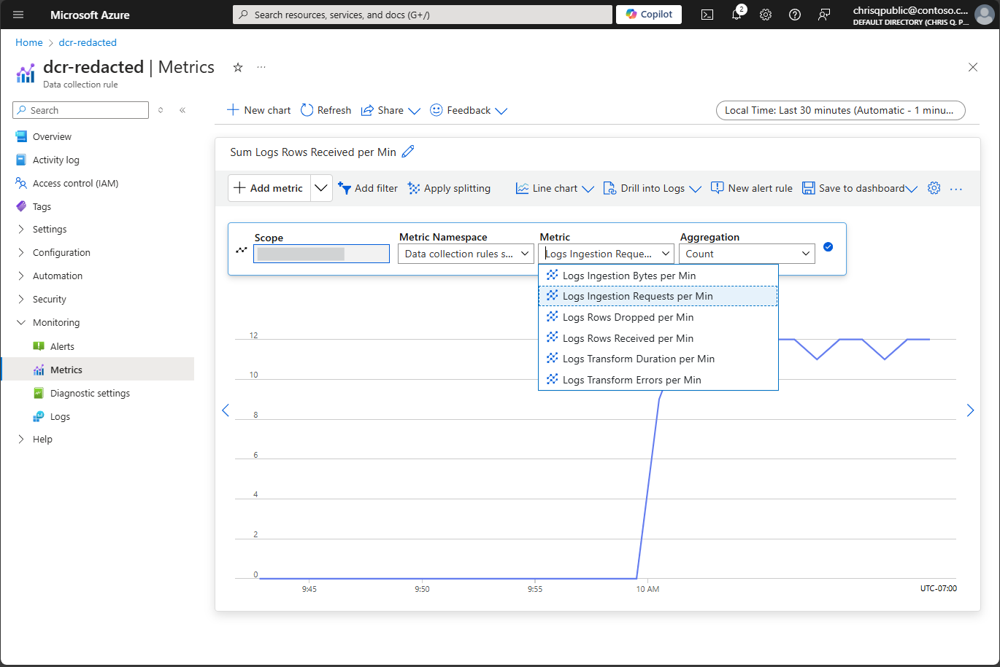
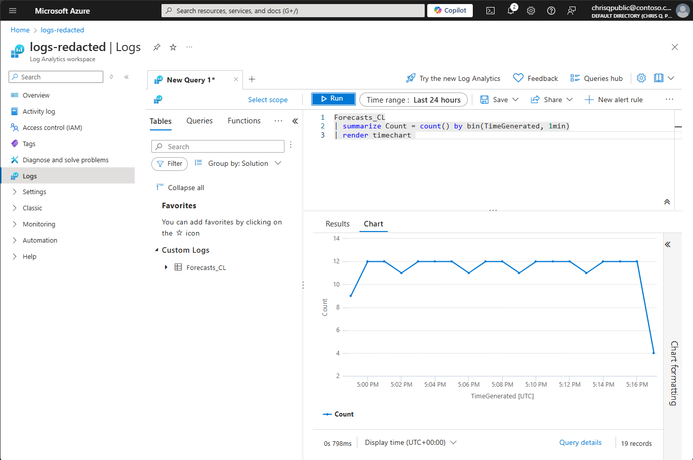

# AzLogs.Ingestion Sample

[](https://github.com/jcoliz/AzLogs.Ingestion/actions/workflows/build.yml)

This is a fully-built sample using the [Logs Ingestion API in Azure Monitor](https://learn.microsoft.com/en-us/azure/azure-monitor/logs/logs-ingestion-api-overview) on .NET 8.0.
The sample retrieves weather forecasts from the U.S. [National Weather Service API](https://www.weather.gov/documentation/services-web-api), then forwards them on to a [Logs Analytics Workspace](https://learn.microsoft.com/en-us/azure/azure-monitor/logs/log-analytics-workspace-overview) using a [Data Collection Rule](https://learn.microsoft.com/en-us/azure/azure-monitor/essentials/data-collection-rule-overview). It runs as a worker service on your local machine.

## Use case

Let's say we have some important data available in an external service, and we want some of that data in our Log Analytics Workspace. However, we don't control the external service, so we can't simply modify it to upload logs directly. What we can do instead is:

* **Extract** the data using a separate process, then send to a Data Collection Endpoint, which will
* **Transform** it into our desired schema using the Data Collection Rule, and
* **Load** it into a Log Analytics Workspace table.

## Prerequisites

In order to follow the instructions shown here, and run this sample, you will first need:

* An Azure Account. Set up a [Free Azure Account](https://azure.microsoft.com/en-us/pricing/purchase-options/azure-account) to get started.
* [Azure CLI tool with Bicep](https://learn.microsoft.com/en-us/azure/azure-resource-manager/bicep/install#azure-cli)

Please read through the [Logs Ingestion API in Azure Monitor](https://learn.microsoft.com/en-us/azure/azure-monitor/logs/logs-ingestion-api-overview) article carefully before proceeding.
This sample will follow that article closely.

## Register a Microsoft Entra app

The very first step is to [Register an application with the Microsoft Identity Platform](https://learn.microsoft.com/en-us/entra/identity-platform/quickstart-register-app?tabs=client-secret) following the steps in that article. Be sure to [Add a client secret](https://learn.microsoft.com/en-us/entra/identity-platform/quickstart-register-app?tabs=client-secret#add-credentials) as described on that page.

After registering the application, you'll also need the Service Principal ID.
For more details, see [Application and service principal objects in Microsoft Entra ID](https://learn.microsoft.com/en-us/entra/identity-platform/app-objects-and-service-principals?tabs=azure-cli). The fastest way to get this is using the Azure CLI, supplying the Client ID for your new application.

```dotnetcli
az ad sp list --filter "appId eq '{Client ID}'"
```

This displays a full list of information about the Service Principal for your application.
The piece you're looking for is the `id` field.

When you're done, you'll have four key pieces of information

* Tenant ID
* Client ID
* Client Secret
* Service Principal ID

## Deploy Azure resources

This sample requires three Azure resources: Log Analytics Workspace, Data Collection Rule, and Data Collection Endpoint.
If you're setting them up in the Azure Portal, the easiest way is create a new Log Analytics resource, then create a custom table.
That flow will lead you down the path of creating a Data Collection Rule with a Data Collection Endpoint.

However, for this sample, there's an even easier way. Here you will find an Azure Resource Manager (ARM) template to set up everything you need, ready to go: [azlogs-ingestion.bicep](./.azure/deploy/azlogs-ingestion.bicep).
Did you clone this repo with submodules? If not, now is the time to init and update submodules so you have the [AzDeploy.Bicep](https://github.com/jcoliz/AzDeploy.Bicep) project handy with the
necessary module templates.

```powershell
git submodule update --init
```

From a PowerShell window in this folder, complete the following steps.

First, we'll set an environment variable to our chosen resource group name. Pick anything that helps you remember what the group is for:

```powershell
$env:RESOURCEGROUP = "azlogs-ingestion"
```

Next, we will create that group, in our chosen location. I'm a fan of [Moses Lake](https://www.datacenters.com/microsoft-azure-west-us-2-washington). You may feel differently.

```powershell
az group create --name $env:RESOURCEGROUP --location "West US 2"
```

Finally, the most important step, where we deploy our resources:

```powershell
az deployment group create --name "Deploy-$(Get-Random)" --resource-group $env:RESOURCEGROUP --template-file .azure\deploy\azlogs-ingestion.bicep --parameters .azure\deploy\azlogs-ingestion.parameters.json
```

You will be prompted to enter the Service Principal ID of the Entra App Registration you created earlier.

```dotnetcli
Please provide string value for 'principalId' (? for help): 
```

After the deployment completes, take note of the outputs from this deployment. You will use these values to configure the sample so it points to your newly-provisioned resources.
Look for the `outputs` section of the deployment. Please refer the configuration section below to find where to put them.

```json
"outputs": {
  "EndpointUri": {
    "type": "String",
    "value": "https://dcep-redacted.westus2-1.ingest.monitor.azure.com"
  },
  "DcrImmutableId": {
    "type": "String",
    "value": "dcr-redacted"
  },
  "Stream": {
    "type": "String",
    "value": "Custom-Forecasts_CL"
  }
},
```

## Configuration

Once you have everyhing above running, you'll need to configure the sample with the App Registration you completed initially,
as well as the details on your Data Collection Rule. You could follow the practices outlined in
[Safe storage of app secrets in development in ASP.NET Core](https://learn.microsoft.com/en-us/aspnet/core/security/app-secrets).

Alternately, you can create a `config.toml` file containing these secrets in the `BackgroundService` folder. This file will not be committed to source control.
To begin, copy the existing `config.template.toml` file to a new file named `config.toml`. Then fill this in with the values unique to your deployment.

```toml
[Identity]
TenantId = "<tenant_id>" # Directory (tenant) ID
AppId = "<client_id>" # Application (client) ID
AppSecret = "<client_secret>" # Client secret value

[LogIngestion]
EndpointUri = "https://<data_collection_endpoint_uri>/" # Data collection endpoint, be sure to include https://
Stream = "<stream_name>" # The stream name to send to, usually `Custom-<table>_CL`
DcrImmutableId = "<data_collection_rule_id>" # The Immutable ID for this Data Collection Rule 
```

Optionally, you could elect to configure the options for connecting to the weather service.
Out of the box, the sample requests a weather forecast for the area surrounding the [Space Needle](https://www.spaceneedle.com/),
checking once every 5 seconds. You can find these values in `appsettings.json`.

```json
"Weather": {
  "Office": "SEW",
  "GridX": 124,
  "GridY": 69,
  "Frequency": "00:00:05"
}
```

The weather office, and grid x,y positions are specific to the NWS grid system. You can find values by calling the `/points/{lat,long}`
endpoint. The NWS has a handy Swagger UI on its API page, so you can try these out diretly.

Frequency is described in in Hours:Minutes:Seconds.

## Running

Once you have all that set up, simply build and run the `BackgroundService` project!

```powershell
dotnet run --project BackgroundService

<6> [ 23/09/2024 12:04:42 ] AzLogs.Ingestion.Worker[1010] FetchForecastAsync: Received OK {"number":1,"name":"Today","startTime":"2024-09-23T11:00:00-07:00","endTime":"2024-09-23T18:00:00-07:00","isDaytime":true,"temperature":72,"temperatureUnit":"F","temperatureTrend":"","probabilityOfPrecipitation":{"value":null,"maxValue":0,"minValue":0,"unitCode":"wmoUnit:percent","qualityControl":"Z"},"dewpoint":null,"relativeHumidity":null,"windSpeed":"6 mph","windGust":null,"windDirection":"SSW","icon":"https://api.weather.gov/icons/land/day/sct?size=medium","shortForecast":"Mostly Sunny","detailedForecast":"Mostly sunny, with a high near 72. South southwest wind around 6 mph."}
<6> [ 23/09/2024 12:04:42 ] AzLogs.Ingestion.Worker[1020] UploadToLogsAsync: Sent OK 204
```

Note that the underlying services all log quite a bit of information to the application logger as well. If you want to see that in action, simply increase the default level in `appsettings.json`:

```json
"Logging": {
  "LogLevel": {
    "Default": "Information",
```

## Verify data flow

After observing that logs are sent successfully to Log Analytics from the client application logs, it's time to turn our attention
to verifying the data has landed correctly in the service. Using the Azure Portal, navigate to the resource group you created above, e.g. `azlogs-ingestion`, then click into the Data Change Rule resource. In the navigation panel on the left, expand "Monitoring", then choose "Metrics". Click "Add Metric", then choose "Logs Ingestion Requests per Min". You should see a chart like the one below:



Next, we can look at the Log Analytics workspace itself to confirm that the logs have landed in their final destination. Again, navigate to the resource group page, but this time click into the Log Analytics resource. Click "Logs", and then enter this query:

```kql
Forecasts_CL
| summarize Count = count() by bin(TimeGenerated, 1min)
| render timechart 
```

If all is well, you will see a chart like the one below:



Congratulations, you have successfully ingested logs into a Log Analytics Workspace custom table using a Data Collection Rule!

## Tear down

When you're done, don't forget to tear down the resource group to avoid unexpected charges.

```powershell
az group delete --yes --name $env:RESOURCEGROUP
```
